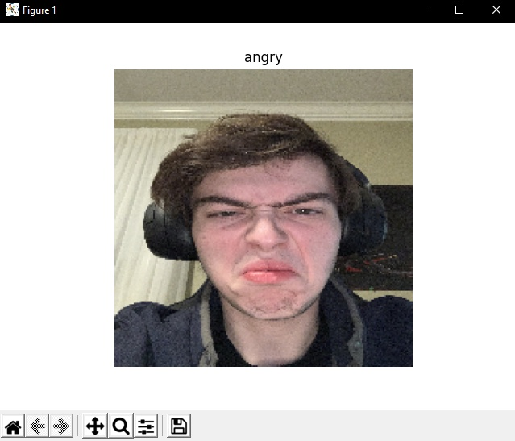

Data Science Final WIT 2020
========

* __[Andrew Galvin](https://github.com/andrewgalvin)__

* __[AJ Salaris](https://github.com/Oracle331)__

* __[Endi Caushi](https://github.com/mrendi29)__

* __[Yuan Gao](https://github.com/yuanionrings)__

Introduction
========
This project is a Python-based facial recognition emotion analysis. It utilizes primarily Keras and Numpy to take in a photo of a face and return a mood. The program consists of two main files, 'Process.py' and 'Train.py'. The process file takes in the input file and converts it into a 48x48 image which is then checked against the model to formulate the expression prediction. The training file similarly converts all the training data into 48x48 images and runs them through the modeler, which is using a sequential model. \
This project was chosen as we all were interested in the growing use of biometrics in technology. The initial question or problem to solve is how do we go out about determining someone's mood based on their facial expression. Using data sets of faces with different facial expressions and the accompanying emotion, we can determine an approximate mood of a person in any given picture. 

Selection of Data
========
The machine learning model was trained using data sets found from __[Kaggle](https://www.kaggle.com/c/challenges-in-representation-learning-facial-expression-recognition-challenge)__. The data used was some of the most simple data available to us. We wanted to ensure the data we used was tested and accurate, so if there was any trouble getting the model to succeed, we could be certain it was not a result of the data. Once the model was successfully trained and returning somewhat expected results, it became more noticable the model was potentially over-fit. On occassion it would classify various photos entirely wrong, which was likely a result of facial features that weren't present in any of the test data. The picture below shows the layout of the data set we chose, where the emotion is on the left(0 = "angry", 1 = "disgust",...), the middle column is the pixel value of the image, and the right column is the usage, where each picture is either Training or PrivateTest. \

Methods
========
In order to solve our initial question of how to determine someone's mood from a picture, we first have to consider each individual step of what the program should do. We knew we would have to read the image into an array because the process of finding a face in a picture by itself would be a whole different project (that many people have helped figure out just for us). Python's packages Keras and TensorFlow work together to provide a set of tools that allow easily deployable machine learning algorithms. Keras acts as a wrapper to make the commands most efficient, and TensorFlow offers a variety of complex mathemetical formulas which perform the intense calculations for our algorithm. With this set of tools, we can easily compress images and score them against the model, as well as build the model. The model we used was a sequential model, that had a batch size of 64 and epoch of 20. The lower numbers allowed repeated tries without melting our CPU's and each epoch took roughly 20 minute, meaning the smaller the epoch, the faster we can start finding out the last time I looked happy. Once we built our models, we simply had to pass the image to the model to form a prediction. Through some trials we were able to settle on a model that claimed to be 97% accurate, although that's probably inflated for reasons discussed below.

Results
========
|Neutral|Angry|Happy|
|----|----|----|
||||

As you can see, our model was able to predict the above emotions. We noticed that the algorithms was best at finding happy or angry emotions, whereas sad and disgust were less frequent. 

Discussion
========
The model included is likely over-fit as it struggles with faces of people of different ethnicities with different facial features. This could be improved with a larger dataset and different amounts of training. When considering that this data set had roughly 36k images, it barely scratches the surface of unique people. The more localized the data set images are, the less accurate the training will be. Additionally, the images are converted to grayscale, which will also cause darker complexions to be washed out, making it harder for the algorithm to be really as diverse as it should be. \
We also wanted to try to deploy our code to Heroku, and were able to get a functional website that allowed a user to upload an image. However, due to TensorFlow Backend taking up almost the entire 300MB capacity of Heroku, we ran into some issues. Our initial program was entirely unprepared for deployment, where everything was through the console and no values were returned. Through some adaptation, we got everything to succesfully compile, but kept being brought back to the issue of running out of storage. 

Summary
========
This project was incredibly fascinating to watch as a computer can turn ones and zeroes into a predicted emotion. Given endless time, we all could have easily taken this project further and further. An interesting step to take for this project would be to train multiple models, to first detect a possible area of origin based on facial features, and then build models based on data sets of unique people proportional to the population. What this would like look would be to first detect a person has features consistent with that of Americans, Europeans, Asians, etc, which would generate a result that would feed into an array of models, then scoring the image based on the model for a given location. This allows for highly accurate data sets, were there would be next to no over-fitting. Furthermore, in order to circumvent the storage limits of Heroku, our next step for deployment would be to use AWS. This would allow more room for growth, and fewer security concerns for uploading an image to an unknown website.

References
========
* Challenges in Representation Learning: A report on three machine learning
contests." I Goodfellow, D Erhan, PL Carrier, A Courville, M Mirza, B
Hamner, W Cukierski, Y Tang, DH Lee, Y Zhou, C Ramaiah, F Feng, R Li,
X Wang, D Athanasakis, J Shawe-Taylor, M Milakov, J Park, R Ionescu,
M Popescu, C Grozea, J Bergstra, J Xie, L Romaszko, B Xu, Z Chuang, and
Y. Bengio. arXiv 2013.
